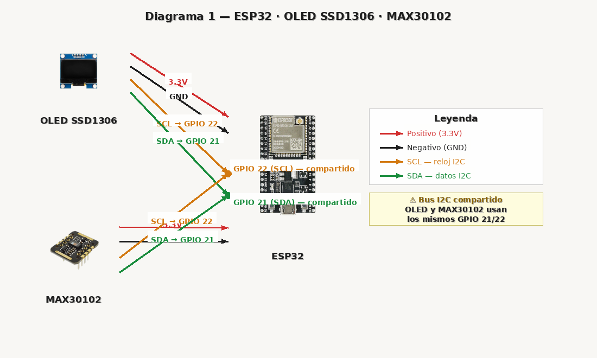
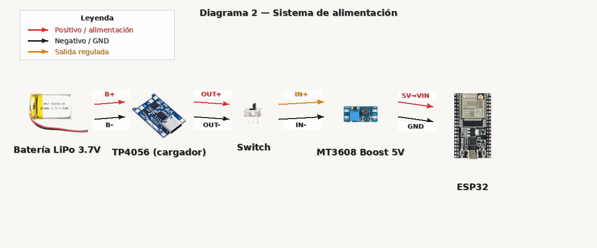

# Monitor Cardiaco IoT — ESP32 + MAX30102

Dispositivo IoT portátil para medir frecuencia cardiaca (BPM) y saturación de oxígeno (SpO2), con visualización en tiempo real mediante una interfaz web servida directamente desde el ESP32 en modo Access Point — sin necesidad de internet ni router.

Proyecto final de la materia **Organización de Computadoras** — Ingeniería en Desarrollo de Software, UABC FCITEC, Grupo 534.

---

##  Tabla de contenidos

- [Características](#-características)
- [Hardware utilizado](#-hardware-utilizado)
- [Diagrama de conexiones](#-diagrama-de-conexiones)
- [Estructura del repositorio](#-estructura-del-repositorio)
- [Instalación](#-instalación)
- [Uso](#-uso)
- [Cómo funciona](#-cómo-funciona)
- [Documentación adicional](#-documentación-adicional)
- [Autor](#-autor)
- [Licencia](#-licencia)

---

## Características

- **Totalmente portátil** — alimentado por batería LiPo recargable vía USB-C
- **Access Point propio** — el ESP32 crea su propia red WiFi, no requiere internet
- **Gráfica en tiempo real** del BPM directamente en el navegador (Canvas API)
- **Refresco cada 1.5 segundos** vía polling JSON
- **Pantalla OLED** con estado del sistema y resultados en vivo
- **Sensor óptico de alta sensibilidad** ajustado para detección confiable de pulso
- **Interfaz web responsiva** sin frameworks externos (HTML + CSS + JS puro)

---

##  Hardware utilizado

| Componente | Modelo | Función |
|---|---|---|
| Microcontrolador | ESP32 DevKit (WROOM-32) | Procesa datos y sirve la página web |
| Sensor biométrico | MAX30102 | Mide pulso óptico y SpO2 |
| Pantalla | OLED SSD1306 (0.96", I2C) | Muestra estado del sistema |
| Carga de batería | TP4056 (USB-C) | Carga la batería LiPo |
| Elevador de voltaje | MT3608 Boost | Convierte 3.7V → 5V |
| Batería | LiPo 3.7V | Alimentación portátil |
| Interruptor | Mini Slide Switch | Encendido / apagado general |

---

##  Diagrama de conexiones

### ESP32 ↔ OLED ↔ MAX30102 (bus I2C compartido)



>  **Importante:** el OLED y el MAX30102 comparten el mismo bus I2C. Ambos se conectan a los **mismos** pines `GPIO 21 (SDA)` y `GPIO 22 (SCL)` del ESP32 — esto es el comportamiento normal del protocolo I2C, que permite múltiples dispositivos en un solo bus de 2 cables.

| Señal | Pin ESP32 | Significado |
|---|---|---|
| SDA | GPIO 21 | *Serial Data* — línea de datos I2C, transmite información en ambas direcciones |
| SCL | GPIO 22 | *Serial Clock* — línea de reloj I2C, el ESP32 la controla para marcar el ritmo de transmisión |

### Sistema de alimentación



```
Batería LiPo → TP4056 (carga) → Switch → MT3608 (boost a 5V) → ESP32 (VIN)
```

---

##  Estructura del repositorio

```
MonitorCardiaco-ESP32/
├── README.md
├── LICENSE
├── .gitignore
├── firmware/
│   └── MonitorCardiaco/
│       ├── MonitorCardiaco.ino     ← Código principal (modo Access Point)
│       └── webpage.h               ← Página web embebida (HTML/CSS/JS)
└── docs/
    ├── algoritmo_proyecto.txt      ← Algoritmo explicado (OLED, sensor, web)
    ├── explicacion_codigo.txt      ← Explicación detallada del código
    └── diagramas/
        ├── diagrama1_esp32_oled_max30102.png
        └── diagrama2_alimentacion.png
```

---

##  Instalación

### Requisitos

- [Arduino IDE 2.x](https://www.arduino.cc/en/software)
- Soporte de placas **ESP32** instalado en el Arduino IDE ([guía oficial](https://docs.espressif.com/projects/arduino-esp32/en/latest/installing.html))
- Driver USB-Serial **CP210x** o **CH340** según tu placa

### Librerías necesarias

Instalar desde el Library Manager del Arduino IDE:

| Librería | Autor |
|---|---|
| `Adafruit GFX Library` | Adafruit |
| `Adafruit SSD1306` | Adafruit |
| `MAX3010x` (SparkFun) | SparkFun Electronics |
| `ArduinoJson` | Benoit Blanchon |

> Las librerías `Wire`, `WiFi` y `WebServer` ya están incluidas en el core de ESP32.

### Pasos

1. Clona o descarga este repositorio
2. Abre `firmware/MonitorCardiaco/MonitorCardiaco.ino` en Arduino IDE
   - **Importante:** `webpage.h` debe estar en la misma carpeta que el `.ino`
3. Selecciona tu placa: `Tools → Board → ESP32 Dev Module`
4. Selecciona el puerto correspondiente
5. Sube el código (`Ctrl+U` / `⌘+U`)

---

##  Uso

1. Al encender, el ESP32 crea una red WiFi llamada **`Monitor-Cardiaco`**
2. Conéctate a esa red desde tu celular o computadora:
   - **Contraseña:** `12345678`
3. Abre tu navegador y entra a:
   ```
   http://192.168.4.1
   ```
4. Coloca el dedo sobre el sensor MAX30102 cuando la pantalla OLED lo indique
5. Mantén el dedo quieto durante los 60 segundos de medición
6. Observa la gráfica de BPM en tiempo real y los resultados finales en la página web

---

##  Cómo funciona

El proyecto se organiza en tres bloques principales, documentados en detalle en `docs/`:

1. **Pantalla OLED (I2C)** — Muestra el estado del sistema usando la librería Adafruit_SSD1306
2. **Sensor MAX30102** — Detecta latidos mediante análisis de luz infrarroja reflejada y calcula BPM y SpO2
3. **Servidor web embebido** — El ESP32 expone dos rutas (`/` y `/datos`) y el navegador consulta `/datos` cada 1.5 segundos vía `fetch()` para actualizar la gráfica sin recargar la página

El firmware funciona como una **máquina de estados** con 4 fases:

```
ESPERANDO → MIDIENDO → MOSTRANDO_RESULTADO → SUBIENDO → (vuelve a ESPERANDO)
```

Para una explicación completa paso a paso, revisa:
- [`docs/algoritmo_proyecto.txt`](docs/algoritmo_proyecto.txt)
- [`docs/explicacion_codigo.txt`](docs/explicacion_codigo.txt)

---

##  Documentación adicional

| Archivo | Contenido |
|---|---|
| [`algoritmo_proyecto.txt`](docs/algoritmo_proyecto.txt) | Algoritmo de uso de OLED, sensor y página web explicado en texto plano |
| [`explicacion_codigo.txt`](docs/explicacion_codigo.txt) | Explicación a fondo de librerías, máquina de estados, cálculo de BPM, servidor web y JSON |

---

##  Autor

**Arath Reyes Gonzalez**
---

## 📄 Licencia

Este proyecto se distribuye bajo la licencia MIT. Consulta el archivo [LICENSE](LICENSE) para más detalles.
